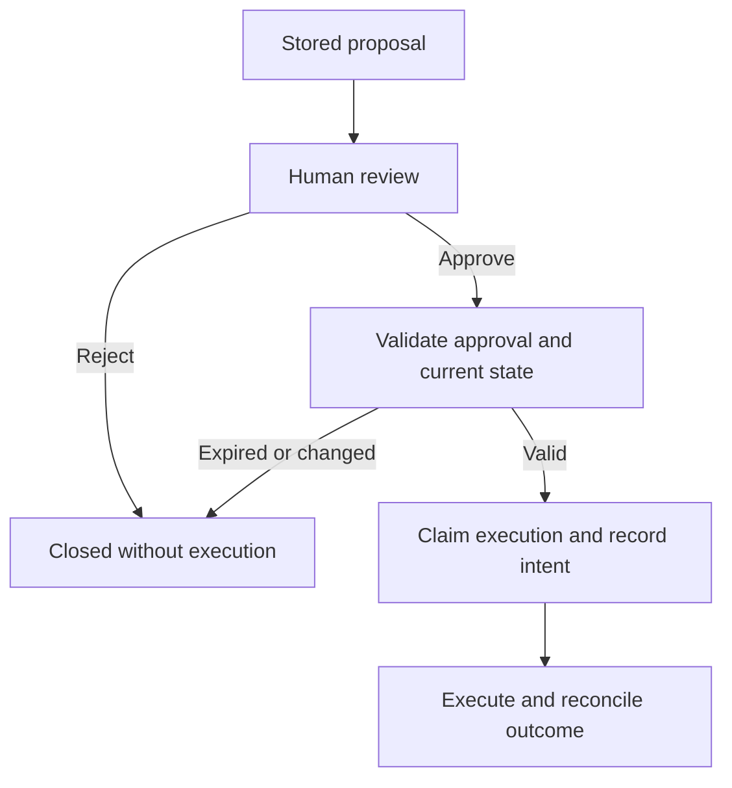

# Human approval is an architecture boundary

**Lloyd Clark, PhD · Engineering field notes · September 2026**

An approval button is useful only if the action executed is the action the person reviewed. An agent that proposes a schedule change, then silently changes its arguments before execution, has crossed that boundary even if an approval appears in the log.

I would design approval around an immutable proposal. Store the exact operation, target, parameters, relevant evidence versions, expected target state, policy version, and expiration time. Show the reviewer a readable rendering of that stored object, including consequential differences. A model-generated summary alone is insufficient for approval.

Serialize the proposal consistently and calculate a cryptographic hash, such as SHA-256. [RFC 8785](https://www.rfc-editor.org/rfc/rfc8785) describes one canonical representation for compatible JSON. The approval record binds the proposal identifier and hash to the authenticated approver, decision, time, and authority scope. Changed content creates a new proposal and requires another decision. A hash detects changed content; authentication, authorization, and protected storage establish who may approve it.

At execution, check the stored bytes against the approved hash, check authorization and expiry, and compare the target's current version with the approved precondition. Use the destination's conditional-write capability where available so a change between checking and writing causes rejection. An unchanged proposal can still become inappropriate when the world changes around it.

Make the transition from approved to executing atomic. In one local transaction, claim the approval, record a durable execution identifier, and enqueue the execution intent. Concurrent workers must not independently claim it. Treat a retry as the same execution: reuse its idempotency key and reject different parameters under that key. Two separately intended identical operations need separate identifiers. [Amazon's Builders' Library](https://aws.amazon.com/builders-library/making-retries-safe-with-idempotent-APIs/) explains this distinction and the need to coordinate mutation with idempotency records.

A database transaction does not automatically cover an external system. If the destination supports idempotency, pass the execution identifier through. If it does not, a timeout creates an uncertain outcome: the operation may have succeeded while the response was lost. Reconcile using a destination reference or operator inspection before retrying. Do not label an uncertain result “failed” and blindly repeat a consequential action.

Expiry limits when an approval can begin execution; it cannot undo an action already committed. Record completion, rejection, expiry, and uncertainty distinctly. Revocation and the execution claim need a defined ordering, so the system can explain which took effect first.

My minimum design review asks:

- Can the reviewer inspect the exact target, parameters, evidence, and effect?
- Does any proposal change invalidate the prior approval?
- Do stale state, expired authority, and duplicate execution attempts stop safely?
- Can an interrupted request be reconciled without inventing success or repeating a side effect?

This is an implementation pattern I recommend, not a claim about a particular deployed product. It turns human oversight into a property the team can test.

[Back to the profile](../README.md) · [Discuss action boundaries](mailto:lc@federal.ai?subject=AI%20approval%20architecture)
